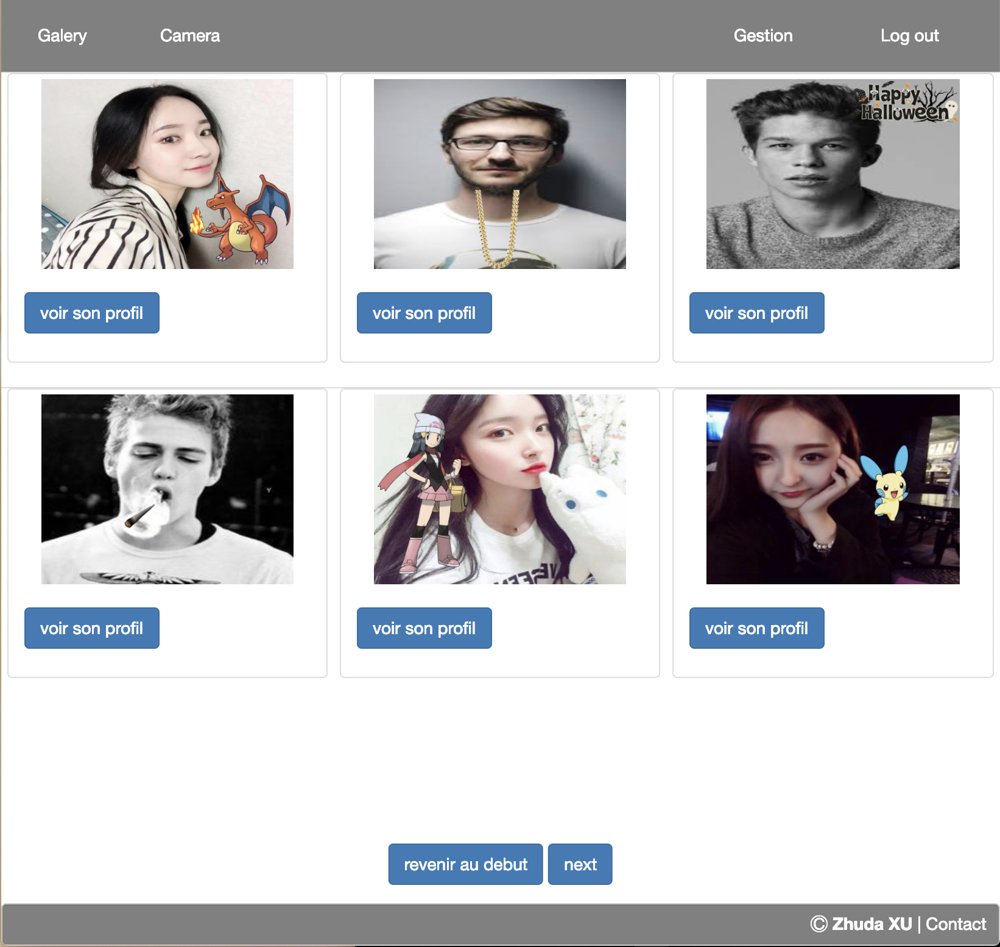
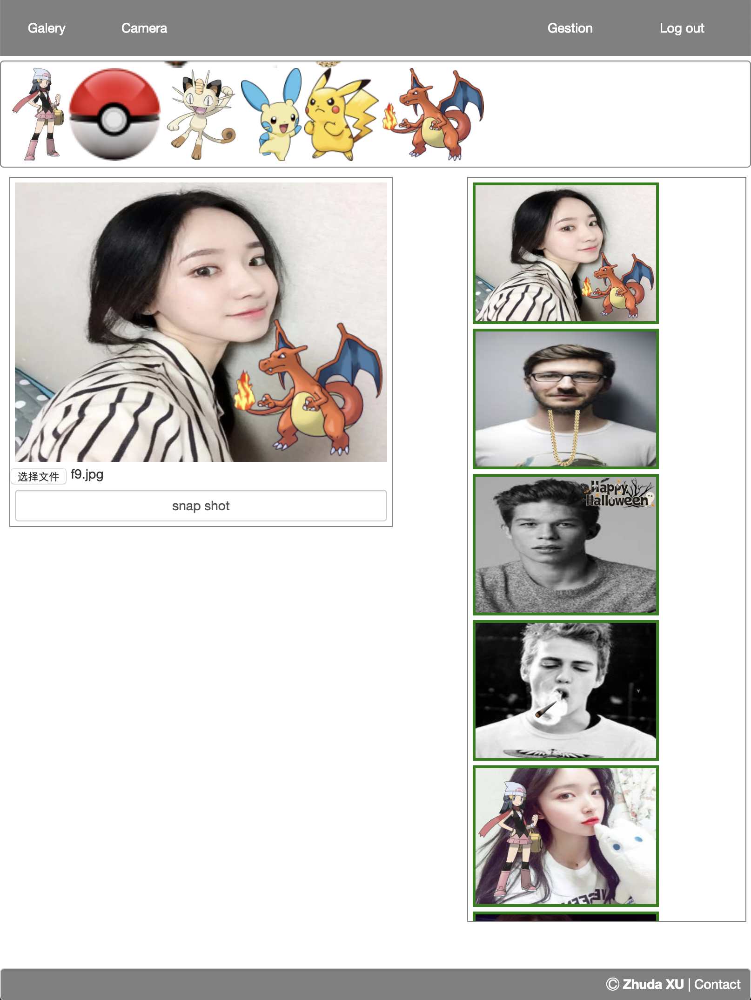

# Camagru

Camagru is a first school web project, you can take photos with the existing images, you can also see, comment, like, other people's photos.

### How to use it in local ?

 - Clone the project in server repertory (I use [MAMP](https://www.mamp.info/en/), so I clone the project in `mamp/apache2/htdocs`), call it `camagru`
 - Enter `localhost:8080/camagru/config/setup.php` to create database (your database username must be `root` and password must be `password`)
 - Now you can use the site, the homepage is `localhost:8080/camagru`.

**Change the port 8080 if you don't use this port for the server.**

### Running

Create an account, and check your email to activate it. (If you use MAMP, check if you have active send mail function)
Connect to your account, and now you can take photos.

### Our stack

We can't use framework.

	* PHP
	* HTML, CSS
	* JavaScript
	* MySQL
